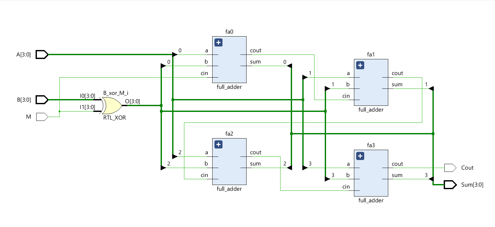
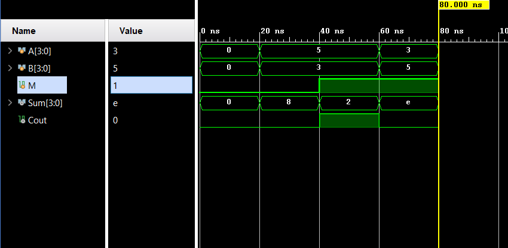
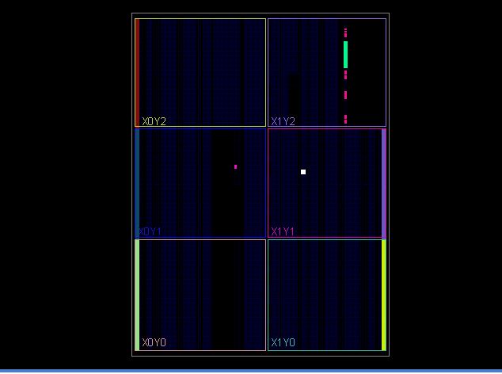

# 4-bit Ripple Carry Adder/Subtractor with 2's Complement Logic

## 🚀 Project Overview
Designed and implemented a structural **4-bit Ripple Carry Adder/Subtractor** in Verilog. This project focuses on **hierarchical module instantiation** and hardware-efficient arithmetic logic. It is capable of performing both addition and subtraction on 4-bit binary numbers using a single control signal.

## 🛠️ Key Features
- **Hierarchical Architecture:** Built by instantiating four 1-bit Full Adder modules.
- **Arithmetic Logic:** Implemented **2's Complement** subtraction using XOR gates to conditionally invert the subtrahend.
- **Control Signal (M):** 
  - `M = 0`: Addition ($Sum = A + B$)
  - `M = 1`: Subtraction ($Sum = A - B$)
- **Verification:** Functional correctness verified via behavioral simulation in **Xilinx Vivado**.

## 📊 Hardware Design & Schematic
The RTL Schematic illustrates the "ripple" effect where the carry-out of one stage is fed into the carry-in of the next.

## 🧪 Simulation Results
The testbench verifies various cases, including:
1. **Addition:** $5 + 3 = 8$
2. **Subtraction (Positive Result):** $5 - 3 = 2$
3. **Subtraction (Negative Result):** $3 - 5 = -2$ (Verified as `1110` in 2's complement).

## 🏗️ FPGA Implementation
The design was synthesized and analyzed for physical placement on an Artix-7 FPGA fabric.

## 📂 File Structure
- `adder_subtractor_4bit.v`: Top-level module with hierarchical instantiation.
- `full_adder.v`: Sub-module for 1-bit addition logic.
- `tb_adder_subtractor.v`: Testbench for functional verification.
